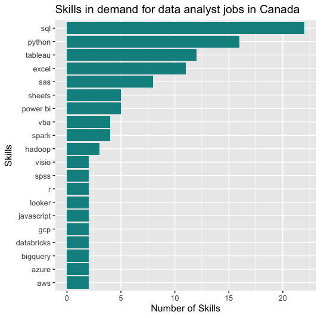
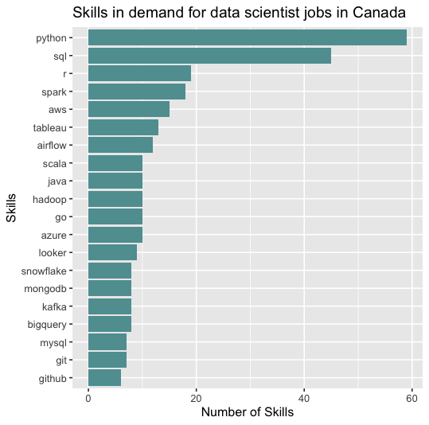
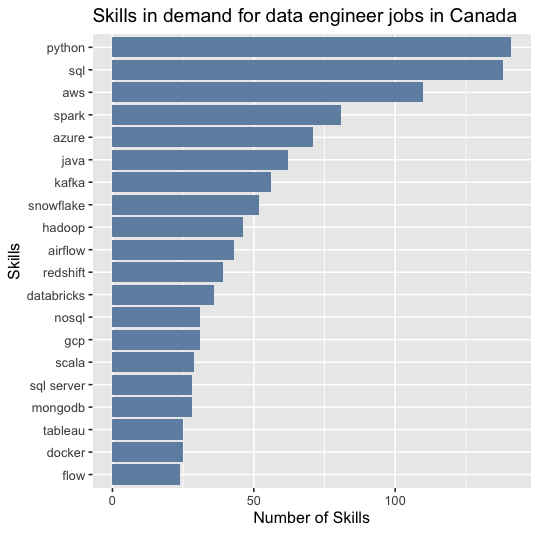

# Introduction

In this SQL-based data analysis project, we explored the job market landscape for data-related roles in Canada, with a specific focus on Data Engineers, Data Scientists, and Data Analysts. With the growing demand for data-driven decision-making across industries, understanding which skills and job titles command the highest salaries can provide valuable insights for job seekers, recruiters, and organizations.

The primary objectives were to:

- Identify the top-paying job roles within the data field.
- Determine the most valuable technical skills based on associated salary data.
- Analyze and recommend optimal skill combinations that maximize earning potential.

Using structured queries, we extracted and analyzed data from job listings, enabling us to uncover key trends and high-paying opportunities. This project not only highlights the financial landscape of data careers in Canada but also provides strategic direction for professionals aiming to enhance their marketability and compensation.

# Background

### Questions to answer:
1. What are the top paying data related jobs?
2. What skills are required for these top paying jobs?
3. What skills are most in demand for
    - Data Analyst
    - Data Scientist
    - Data Engineering
4. What skills are associated with higher salaries?
5. What are the most optimal skills to learn?

# Analysis

### What are the top paying Data related jobs in Canada?

```sql
SELECT
    job_id,
    job_title_short,
    job_title,
    job_location,
    job_schedule_type,
    salary_year_avg,
    job_posted_date,
    name AS company_name
FROM
    job_postings_fact
LEFT JOIN company_dim ON job_postings_fact.company_id = company_dim.company_id
WHERE
    job_title_short LIKE '%Data%' AND
    job_location LIKE '%Canada%' AND
    salary_year_avg IS NOT NULL
ORDER BY
    salary_year_avg DESC
```

The top 10 results with the highest salaries at the time when the data was collected was condensed into the table below:

|job_title_short      |job_title                                                             |job_location                   |salary_year_avg|company_name                        |
|---------------------|----------------------------------------------------------------------|-------------------------------|---------------|------------------------------------|
|Data Engineer        |Director of Engineering, Data Platform                                |Toronto, ON, Canada            |375000.0       |Ripple                              |
|Data Scientist       |Head of Data                                                          |Toronto, ON, Canada            |350000.0       |Mercury                             |
|Data Engineer        |Distinguished Data Engineer, Card Commercialization (Remote Eligible) |Richmond, BC, Canada           |244500.0       |eSmartloan                          |
|Senior Data Scientist|Senior Data Scientist, Experimentation Platform                       |Canada                         |231000.0       |Grammarly                           |
|Senior Data Scientist|Senior Data Scientist, Trust                                          |Canada                         |231000.0       |Grammarly                           |
|Data Engineer        |Principal Engineer, Data Engineering                                  |Toronto, ON, Canada            |225000.0       |Ripple                              |
|Data Scientist       |Staff Strategic Data Scientist                                        |Canada                         |224000.0       |Course Hero                         |
|Data Engineer        |Lead Data Engineer                                                    |British Columbia, Canada       |211000.0       |Capital One                         |
|Data Engineer        |Senior Software Engineer, Data                                        |Toronto, ON, Canada            |200000.0       |Gusto                               |
|Senior Data Engineer |Senior Data Engineer                                                  |Toronto, ON, Canada            |200000.0       |Mercury                             |

It can be seen that data engineers had the highest salaries out of a list of 311 job postings.

### What skills are needed for the top paying Data Analyst jobs?

```sql
WITH top_paying_jobs AS (
    SELECT
        job_id,
        job_title_short,
        job_title,
        job_location,
        salary_year_avg,
        name AS company_name
    FROM
        job_postings_fact
    LEFT JOIN company_dim ON job_postings_fact.company_id = company_dim.company_id
    WHERE
        job_title_short LIKE '%Data%'AND
        job_location LIKE '%Canada%' AND
        salary_year_avg IS NOT NULL
    ORDER BY
        salary_year_avg DESC
)

SELECT 
    top_paying_jobs.*,
    skills
FROM top_paying_jobs
INNER JOIN skills_job_dim ON top_paying_jobs.job_id = skills_job_dim.job_id
INNER JOIN skills_dim ON skills_job_dim.skill_id = skills_dim.skill_id
WHERE job_title_short LIKE '%Analyst%'
ORDER BY
    salary_year_avg DESC;
```


*Bar graph visualizing the top 20 skills in demand for data analyst jobs. Made in R Studio, given data set from sql query above.*

These results suggest that SQL, Python, Tableau, and Excel are the most essential and commonly requested tools for Data Analyst roles in Canada.

### What skills are needed for the top paying Data Scientist jobs?
```sql
WITH top_paying_jobs AS (
    SELECT
        job_id,
        job_title_short,
        job_title,
        job_location,
        salary_year_avg,
        name AS company_name
    FROM
        job_postings_fact
    LEFT JOIN company_dim ON job_postings_fact.company_id = company_dim.company_id
    WHERE
        job_title_short LIKE '%Data%'AND
        job_location LIKE '%Canada%' AND
        salary_year_avg IS NOT NULL
    ORDER BY
        salary_year_avg DESC
)

SELECT 
    top_paying_jobs.*,
    skills
FROM top_paying_jobs
INNER JOIN skills_job_dim ON top_paying_jobs.job_id = skills_job_dim.job_id
INNER JOIN skills_dim ON skills_job_dim.skill_id = skills_dim.skill_id
WHERE job_title_short LIKE '%Scientist%'
ORDER BY
    salary_year_avg DESC;
```


*Bar graph visualizing the top 20 skills in demand for data scientist jobs. Made in R Studio, given data set from sql query above.*

This shows that Python and SQL are foundational, while cloud platforms (AWS, Azure), big data tools (Spark), and workflow tools like Airflow are also highly valued in data science roles.

### What skills are needed for the top paying Data Engineering jobs?

```sql
WITH top_paying_jobs AS (
    SELECT
        job_id,
        job_title_short,
        job_title,
        job_location,
        salary_year_avg,
        name AS company_name
    FROM
        job_postings_fact
    LEFT JOIN company_dim ON job_postings_fact.company_id = company_dim.company_id
    WHERE
        job_title_short LIKE '%Data%'AND
        job_location LIKE '%Canada%' AND
        salary_year_avg IS NOT NULL
    ORDER BY
        salary_year_avg DESC
)

SELECT 
    top_paying_jobs.*,
    skills
FROM top_paying_jobs
INNER JOIN skills_job_dim ON top_paying_jobs.job_id = skills_job_dim.job_id
INNER JOIN skills_dim ON skills_job_dim.skill_id = skills_dim.skill_id
WHERE job_title_short LIKE '%Engineer%'
ORDER BY
    salary_year_avg DESC;
```


*Bar graph visualizing the top 20 skills in demand for data engineering jobs. Made in R Studio, given data set from sql query above.*

This reflects the strong emphasis on data pipelines, cloud platforms, and distributed systems for data engineering work—especially proficiency in Python, SQL, and AWS.

## Understanding the Most optimal skills based on skill and salary

### Data Analysts
```sql
SELECT
    skills,
    ROUND (AVG(salary_year_avg), 0) AS avg_salary,
    COUNT(skills) AS skill_count
FROM job_postings_fact
INNER JOIN skills_job_dim ON job_postings_fact.job_id = skills_job_dim.job_id
INNER JOIN skills_dim ON skills_job_dim.skill_id = skills_dim.skill_id
WHERE
        (job_title_short LIKE '%Data%' AND
        job_location LIKE '%Canada%' AND
        salary_year_avg IS NOT NULL) AND
        job_title_short LIKE '%Analyst%'-- Replace with "Scientist" or "Analyst"

        
GROUP BY
    skills
HAVING 
 COUNT(skills) >= 10
ORDER BY
    avg_salary DESC
```

**Results**
|skills |avg_salary           |skill_count                                                           |
|-------|---------------------|----------------------------------------------------------------------|
|sql    |99186                |22                                                                    |
|python |98818                |16                                                                    |
|tableau|97223                |12                                                                    |
|excel  |88583                |11                                                                    |

- **SQL** is the most in-demand skill (22 listings) and has the highest average salary, making it the most essential skill for Data Analysts.

- **Python** is nearly as valuable, showing up frequently and tied to high-paying roles — great for automation, data wrangling, and basic analytics.

- **Tableau** is a high-paying skill for analysts focused on visualization and dashboarding.

- **Excel**, while still valuable and commonly requested, correlates with slightly lower salaries, suggesting it may be more prevalent in entry-level or less technical roles.

### Data Scientist
```sql
SELECT
    skills,
    ROUND (AVG(salary_year_avg), 0) AS avg_salary,
    COUNT(skills) AS skill_count
FROM job_postings_fact
INNER JOIN skills_job_dim ON job_postings_fact.job_id = skills_job_dim.job_id
INNER JOIN skills_dim ON skills_job_dim.skill_id = skills_dim.skill_id
WHERE
        (job_title_short LIKE '%Data%' AND
        job_location LIKE '%Canada%' AND
        salary_year_avg IS NOT NULL) AND
        job_title_short LIKE '%Scientist%'-- Replace with "Scientist" or "Analyst"

        
GROUP BY
    skills
HAVING 
 COUNT(skills) > 10
ORDER BY
    avg_salary DESC
```

**Results**

|skills |avg_salary           |skill_count                                                           |
|-------|---------------------|----------------------------------------------------------------------|
|r      |137556               |19                                                                    |
|sql    |134573               |45                                                                    |
|tableau|133086               |13                                                                    |
|airflow|132226               |12                                                                    |
|python |126276               |59                                                                    |
|spark  |123859               |18                                                                    |
|aws    |112452               |15                                                                    |

- **Python** is the most in-demand skill by far (59 listings), and while not the top-paying, it's essential and foundational to nearly all Data Scientist roles.

- **R**, **SQL**, and Tableau offer the highest average salaries, suggesting they are especially valuable in roles requiring statistical modeling, data querying, and business reporting.
- **Airflow** and **Spark** are high-paying and reflect growing demand for Data Scientists who can work with large-scale data and manage pipelines — overlapping with Data Engineering tasks.
- **AWS** is a useful cloud skill but shows slightly lower average salaries, possibly due to its broader applicability across roles.

### Data Engineer
```sql
SELECT
    skills,
    ROUND (AVG(salary_year_avg), 0) AS avg_salary,
    COUNT(skills) AS skill_count
FROM job_postings_fact
INNER JOIN skills_job_dim ON job_postings_fact.job_id = skills_job_dim.job_id
INNER JOIN skills_dim ON skills_job_dim.skill_id = skills_dim.skill_id
WHERE
        (job_title_short LIKE '%Data%' AND
        job_location LIKE '%Canada%' AND
        salary_year_avg IS NOT NULL) AND
        job_title_short LIKE '%Engineer%'-- Replace with "Scientist" or "Analyst"

        
GROUP BY
    skills
HAVING 
 COUNT(skills) > 40
ORDER BY
    avg_salary DESC
```

**Results**

|skills |avg_salary           |skill_count                                                           |
|-------|---------------------|----------------------------------------------------------------------|
|snowflake|122565               |52                                                                    |
|kafka  |121902               |56                                                                    |
|java   |121867               |62                                                                    |
|airflow|120971               |43                                                                    |
|aws    |120700               |110                                                                   |
|spark  |118506               |81                                                                    |
|hadoop |118183               |46                                                                    |
|python |116967               |141                                                                   |
|sql    |115988               |138                                                                   |
|azure  |114757               |71                                                                    |

- **Python** and **SQL** are the most in-demand skills (141 and 138 postings), showing they are essential for virtually every Data Engineering role.

- Cloud and big data tools — **AWS**, **Azure**, **Spark**, **Hadoop** — are critical and often expected in large-scale data environments.

- **Snowflake**, **Kafka**, and **Java** command the highest average salaries, signaling that experience in real-time streaming (Kafka), cloud-native data warehousing (Snowflake), and backend languages (Java) can elevate compensation.

- **Airflow** is also valuable, indicating the importance of workflow orchestration and pipeline automation.

# Key Take Aways

To be a competitive and well-paid **Data Analyst** in Canada, focusing on SQL and Python as foundational skills, and then adding Tableau for visualization will position you well.

To maximize both market demand and salary, a strong **Data Scientist** in Canada should master:

- Python and SQL (essential and frequently required)

- R (for statistical depth and higher pay)

- Tools like Tableau, Airflow, and Spark (for added value in analytics and engineering).

To stand out as a well-paid **Data Engineer** in Canada:

- Must-have skills: Python, SQL, AWS, Spark

- High-paying edge skills: Snowflake, Kafka, Java, Airflow

- Cloud breadth: Knowledge in both AWS and Azure can improve flexibility and value across industries.